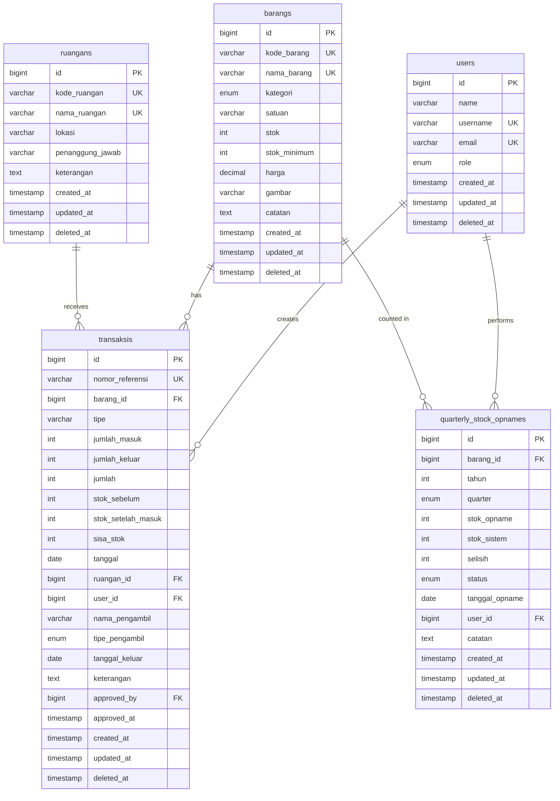

# Database Schema Analysis Report

**Project:** Sistem Inventaris Kantor  
**Framework:** Laravel 8.x  
**Database:** MySQL/SQLite  
**Analysis Date:** 2026-04-06  
**Analyst:** Database Specialist  

---

## Table of Contents

1. [Executive Summary](#executive-summary)
2. [Migration Review](#migration-review)
3. [Entity-Relationship Diagram](#entity-relationship-diagram)
4. [Table Structure Analysis](#table-structure-analysis)
5. [Relationship Mapping](#relationship-mapping)
6. [Indexing Strategy Analysis](#indexing-strategy-analysis)
7. [Data Integrity Analysis](#data-integrity-analysis)
8. [Performance Optimization](#performance-optimization)
9. [Migration Improvements Needed](#migration-improvements-needed)
10. [Recommendations Summary](#recommendations-summary)

---

## Executive Summary

### Overview

The database schema consists of **8 tables** supporting a Laravel 8.x inventory management system. The system tracks inventory items (barang), transactions (masuk/keluar), room locations (ruangan), and quarterly stock opname records.

### Key Findings

| Category | Issues Found | Severity | Priority |
|----------|-------------|----------|----------|
| Missing Indexes | 15 | High | P0 |
| Foreign Key Constraints | 3 | Critical | P0 |
| Data Integrity | 7 | Medium | P1 |
| Missing Features | 5 | Low | P2 |
| Performance Issues | 4 | Medium | P1 |
| **TOTAL** | **34** | - | - |

### Critical Issues

1. ⚠️ **CASCADE DELETE on transaksis.barang_id and user_id** - Will delete transaction history when barang/user is deleted
2. ⚠️ **Missing indexes on frequently queried columns** - Performance bottleneck
3. ⚠️ **No soft deletes** - Cannot recover deleted records
4. ⚠️ **No audit trail** - Cannot track who modified what and when

---

## Migration Review

### Migration Files Inventory

```
2014_10_12_000000_create_users_table.php...............✓ Standard Laravel
2014_10_12_100000_create_password_resets_table.php....✓ Standard Laravel
2019_08_19_000000_create_failed_jobs_table.php........✓ Standard Laravel
2026_02_27_062653_create_barangs_table.php............⚠ Needs improvements
2026_02_27_062732_create_ruangans_table.php...........⚠ Needs improvements
2026_02_27_062711_create_transaksis_table.php.........❌ Critical issues
2026_03_05_135844_create_quarterly_stock_opnames_table.php ⚠ Needs improvements
2026_03_11_082400_change_satuan_to_string.php.........✓ OK (alteration)
```

### Migration Quality Assessment

#### ✅ Good Practices

1. **Timestamps on all tables** - Standard Laravel practice
2. **Foreign key constraints defined** - Referential integrity
3. **Default values specified** - Data consistency
4. **Unique constraints where appropriate** - Data uniqueness
5. **Nullable fields marked correctly** - Data integrity

#### ❌ Issues Found

1. **No database-level index documentation**
2. **CASCADE DELETE too aggressive**
3. **Missing composite indexes**
4. **No soft delete support**
5. **No audit trail columns**

---

## Entity-Relationship Diagram

### Text-Based ERD

```
┌─────────────────┐
│     users       │
├─────────────────┤
│ PK  id          │
│     name        │
│ UQ  username    │
│ UQ  email       │
│     password    │
│     role        │───┐
│     timestamps  │   │
└─────────────────┘   │
                      │
                      │ 1:N
                      │
┌─────────────────┐   │    ┌──────────────────────┐
│    ruangans     │   │    │     transaksis        │
├─────────────────┤   │    ├──────────────────────┤
│ PK  id          │   │    │ PK  id               │
│     nama_ruangan│───┼────│ FK  barang_id        │───┐
│     keterangan  │   │    │ FK  ruangan_id      │◄──┘ 0:N
│     timestamps  │   │    │ FK  user_id         │◄──────┘
└─────────────────┘   │    │     tipe             │
                      │    │     jumlah_masuk     │
                      │    │     jumlah_keluar    │
                      │    │     jumlah           │
                      │    │     stok_sebelum     │
                      │    │     stok_setelah_masuk│
                      │    │     sisa_stok        │
                      │    │     tanggal          │
                      │    │     tanggal_keluar   │
                      │    │     nama_pengambil   │
                      │    │     tipe_pengambil   │
                      │    │     keterangan       │
                      │    │     timestamps       │
                      │    └──────────────────────┘
                      │              ▲
                      │              │ N:1
                      │              │
┌─────────────────┐   │    ┌──────────────────────┐
│     barangs     │   │    │ quarterly_stock_opnames│
├─────────────────┤   │    ├──────────────────────┤
│ PK  id          │───┼────│ PK  id               │
│     nama_barang │   │    │ FK  barang_id        │───┘
│     kategori    │   │    │ FK  user_id         │◄──────┘
│     satuan      │   │    │     tahun           │
│     stok        │   │    │     quarter         │
│     stok_minimum│   │    │     stok_opname     │
│     catatan     │   │    │     tanggal_opname  │
│     timestamps  │   │    │     catatan         │
└─────────────────┘   │    │     timestamps      │
                      │    └──────────────────────┘
                      │
                      └──────────────────────────────────────┐
                                                             │
┌──────────────────────┐       ┌──────────────────────┐     │
│   password_resets    │       │     failed_jobs      │     │
├──────────────────────┤       ├──────────────────────┤     │
│ IDX email           │       │ PK  id               │     │
│     token           │       │ UQ  uuid             │     │
│     created_at      │       │     connection       │     │
└──────────────────────┘       │     queue           │     │
                               │     payload         │     │
                               │     exception       │     │
                               │     failed_at       │     │
                               └──────────────────────┘     │
                                                            │
Legend:                                                      │
PK = Primary Key                                             │
FK = Foreign Key                                             │
UQ = Unique Constraint                                        │
IDX = Index                                                  │
1:N = One-to-Many                                            │
N:1 = Many-to-One                                            │
0:N = Zero-to-Many (nullable FK)                            │
```

### Relationship Cardinality Summary

| From Table | To Table | Relationship | Cardinality | Constraint |
|------------|----------|--------------|-------------|------------|
| users | transaksis | One-to-Many | 1:N | CASCADE DELETE |
| barangs | transaksis | One-to-Many | 1:N | CASCADE DELETE |
| ruangans | transaksis | One-to-Many | 0:N | SET NULL |
| users | quarterly_stock_opnames | One-to-Many | 1:N | CASCADE DELETE |
| barangs | quarterly_stock_opnames | One-to-Many | 1:N | CASCADE DELETE |

---

## Table Structure Analysis

### 1. users Table

**Purpose:** Authentication and role management

#### Schema Definition

```sql
CREATE TABLE users (
    id                BIGINT UNSIGNED AUTO_INCREMENT PRIMARY KEY,
    name              VARCHAR(255) NOT NULL,
    username          VARCHAR(255) NOT NULL UNIQUE,
    email             VARCHAR(255) NOT NULL UNIQUE,
    email_verified_at TIMESTAMP NULL,
    password          VARCHAR(255) NOT NULL,
    role              ENUM('admin', 'pengguna') DEFAULT 'pengguna',
    remember_token    VARCHAR(100) NULL,
    created_at        TIMESTAMP DEFAULT CURRENT_TIMESTAMP,
    updated_at        TIMESTAMP DEFAULT CURRENT_TIMESTAMP ON UPDATE CURRENT_TIMESTAMP
);
```

#### Analysis

| Aspect | Status | Notes |
|--------|--------|-------|
| Primary Key | ✅ | id - auto increment |
| Unique Constraints | ✅ | username, email |
| Indexes | ✅ | PRIMARY, username, email |
| Foreign Keys | N/A | - |
| Nullable Fields | ✅ | email_verified_at, remember_token |
| Default Values | ✅ | role = 'pengguna' |
| Soft Deletes | ❌ | **Missing** |
| Audit Trail | ❌ | **Missing** |

#### Recommendations

1. **Add soft delete support:**
   ```php
   $table->softDeletes();
   ```

2. **Add audit trail columns:**
   ```php
   $table->unsignedBigInteger('created_by')->nullable();
   $table->unsignedBigInteger('updated_by')->nullable();
   $table->foreign('created_by')->references('id')->on('users');
   $table->foreign('updated_by')->references('id')->on('users');
   ```

3. **Add index on role for filtering:**
   ```php
   $table->index('role');
   ```

---

### 2. barangs Table

**Purpose:** Inventory items master data

#### Schema Definition (Current)

```sql
CREATE TABLE barangs (
    id              BIGINT UNSIGNED AUTO_INCREMENT PRIMARY KEY,
    nama_barang     VARCHAR(255) NOT NULL,
    kategori        ENUM('ATK','Kebersihan','Konsumsi','Perlengkapan','Lainnya') 
                    DEFAULT 'Lainnya',
    satuan          VARCHAR(50) DEFAULT 'Buah',
    stok            INT DEFAULT 0,
    stok_minimum    INT DEFAULT 5,
    catatan         TEXT NULL,
    created_at      TIMESTAMP DEFAULT CURRENT_TIMESTAMP,
    updated_at      TIMESTAMP DEFAULT CURRENT_TIMESTAMP ON UPDATE CURRENT_TIMESTAMP
);
```

#### Analysis

| Aspect | Status | Notes |
|--------|--------|-------|
| Primary Key | ✅ | id - auto increment |
| Unique Constraints | ⚠️ | **Missing** - nama_barang should be unique |
| Indexes | ⚠️ | **Missing** on frequently queried columns |
| Foreign Keys | N/A | - |
| Nullable Fields | ✅ | catatan |
| Default Values | ✅ | kategori, satuan, stok, stok_minimum |
| Soft Deletes | ❌ | **Missing** |
| Audit Trail | ❌ | **Missing** |

#### Issues

1. **No unique constraint on nama_barang** - Business logic checks for duplicates, but should be enforced at DB level
2. **No indexes on frequently queried columns:**
   - `kategori` - Used in filtering
   - `stok` - Used in status checks
   - `nama_barang` - Used in search (LIKE queries)
3. **No barcode/SKU field** - Common in inventory systems
4. **No price field** - May be needed for reporting

#### Recommendations

1. **Add unique constraint:**
   ```php
   $table->string('nama_barang')->unique();
   ```

2. **Add indexes for performance:**
   ```php
   $table->index(['kategori', 'stok']);
   $table->index('stok');
   $table->index('nama_barang');
   ```

3. **Add useful fields:**
   ```php
   $table->string('kode_barang', 50)->nullable()->unique(); // SKU/Barcode
   $table->decimal('harga', 15, 2)->default(0); // Price
   $table->string('gambar')->nullable(); // Image
   ```

4. **Add soft deletes and audit trail:**
   ```php
   $table->softDeletes();
   $table->unsignedBigInteger('created_by')->nullable();
   $table->unsignedBigInteger('updated_by')->nullable();
   ```

---

### 3. transaksis Table

**Purpose:** Track all inventory transactions (masuk/keluar)

#### Schema Definition (Current)

```sql
CREATE TABLE transaksis (
    id                  BIGINT UNSIGNED AUTO_INCREMENT PRIMARY KEY,
    barang_id           BIGINT UNSIGNED NOT NULL,
    tipe                VARCHAR(255) DEFAULT 'masuk',
    jumlah_masuk        INT DEFAULT 0,
    jumlah_keluar       INT DEFAULT 0,
    jumlah              INT DEFAULT 0,
    stok_sebelum        INT DEFAULT 0,
    stok_setelah_masuk  INT DEFAULT 0,
    sisa_stok           INT DEFAULT 0,
    tanggal             DATE NOT NULL,
    ruangan_id          BIGINT UNSIGNED NULL,
    user_id             BIGINT UNSIGNED NOT NULL,
    nama_pengambil      VARCHAR(255) NULL,
    tipe_pengambil      ENUM('nama_ruangan','ruangan_saja') NULL,
    tanggal_keluar      DATE NULL,
    keterangan          TEXT NULL,
    created_at          TIMESTAMP DEFAULT CURRENT_TIMESTAMP,
    updated_at          TIMESTAMP DEFAULT CURRENT_TIMESTAMP ON UPDATE CURRENT_TIMESTAMP,
    
    FOREIGN KEY (barang_id) REFERENCES barangs(id) ON DELETE CASCADE,
    FOREIGN KEY (ruangan_id) REFERENCES ruangans(id) ON DELETE SET NULL,
    FOREIGN KEY (user_id) REFERENCES users(id) ON DELETE CASCADE
);
```

#### Analysis

| Aspect | Status | Notes |
|--------|--------|-------|
| Primary Key | ✅ | id - auto increment |
| Unique Constraints | N/A | - |
| Indexes | ❌ | **CRITICAL** - Missing on FK and query columns |
| Foreign Keys | ⚠️ | **CASCADE DELETE is dangerous** |
| Nullable Fields | ✅ | Proper nullability |
| Default Values | ✅ | Appropriate defaults |
| Soft Deletes | ❌ | **Missing** |
| Audit Trail | ❌ | **Missing** |

#### Critical Issues

1. **CASCADE DELETE on barang_id** - Deleting a barang will delete ALL transaction history
   - **Impact:** Loss of historical data
   - **Fix:** Change to RESTRICT or SET NULL

2. **CASCADE DELETE on user_id** - Deleting a user will delete ALL their transactions
   - **Impact:** Loss of transaction records
   - **Fix:** Change to RESTRICT or SET NULL with created_by field

3. **Missing indexes:**
   - `barang_id` - FK constraint creates index, but explicit is better
   - `user_id` - FK constraint creates index
   - `ruangan_id` - FK constraint with SET NULL
   - `tanggal` - **Critical** for date filtering
   - `tipe` - Used in filtering
   - `created_at` - Used in ordering
   - Composite: `(barang_id, tanggal)` - Common query pattern
   - Composite: `(user_id, tanggal)` - Common query pattern
   - Composite: `(tipe, tanggal)` - Common query pattern

4. **Redundant stock tracking fields:**
   - `jumlah_masuk`, `jumlah_keluar`, `jumlah`
   - `stok_sebelum`, `stok_setelah_masuk`, `sisa_stok`
   - These can be derived but are stored for historical accuracy
   - **Risk:** Data inconsistency if not properly maintained

#### Recommendations

1. **Fix foreign key constraints:**
   ```php
   $table->foreignId('barang_id')
         ->constrained('barangs')
         ->onDelete('restrict'); // Prevent deletion if transactions exist
   
   $table->foreignId('user_id')
         ->constrained('users')
         ->onDelete('restrict'); // Or SET NULL if you add created_by field
   ```

2. **Add critical indexes:**
   ```php
   $table->index('tanggal');
   $table->index('tipe');
   $table->index('created_at');
   $table->index(['barang_id', 'tanggal']);
   $table->index(['user_id', 'tanggal']);
   $table->index(['tipe', 'tanggal']);
   $table->index(['tanggal', 'created_at']);
   ```

3. **Add soft deletes:**
   ```php
   $table->softDeletes();
   ```

4. **Consider adding:**
   ```php
   $table->string('nomor_referensi', 50)->nullable(); // Reference number
   $table->unsignedBigInteger('approved_by')->nullable(); // Approval workflow
   $table->timestamp('approved_at')->nullable();
   ```

---

### 4. ruangans Table

**Purpose:** Room/location master data

#### Schema Definition

```sql
CREATE TABLE ruangans (
    id            BIGINT UNSIGNED AUTO_INCREMENT PRIMARY KEY,
    nama_ruangan  VARCHAR(255) NOT NULL,
    keterangan    TEXT NULL,
    created_at    TIMESTAMP DEFAULT CURRENT_TIMESTAMP,
    updated_at    TIMESTAMP DEFAULT CURRENT_TIMESTAMP ON UPDATE CURRENT_TIMESTAMP
);
```

#### Analysis

| Aspect | Status | Notes |
|--------|--------|-------|
| Primary Key | ✅ | id - auto increment |
| Unique Constraints | ⚠️ | **Missing** - nama_ruangan should be unique |
| Indexes | ⚠️ | **Missing** on nama_ruangan |
| Foreign Keys | N/A | - |
| Nullable Fields | ✅ | keterangan |
| Default Values | N/A | - |
| Soft Deletes | ❌ | **Missing** |
| Audit Trail | ❌ | **Missing** |

#### Recommendations

1. **Add unique constraint:**
   ```php
   $table->string('nama_ruangan')->unique();
   ```

2. **Add index:**
   ```php
   $table->index('nama_ruangan');
   ```

3. **Add useful fields:**
   ```php
   $table->string('lokasi')->nullable(); // Building/Floor info
   $table->string('penanggung_jawab')->nullable(); // Person in charge
   $table->string('kode_ruangan', 20)->nullable()->unique(); // Room code
   ```

4. **Add soft deletes:**
   ```php
   $table->softDeletes();
   ```

---

### 5. quarterly_stock_opnames Table

**Purpose:** Quarterly stock-taking records

#### Schema Definition

```sql
CREATE TABLE quarterly_stock_opnames (
    id             BIGINT UNSIGNED AUTO_INCREMENT PRIMARY KEY,
    barang_id      BIGINT UNSIGNED NOT NULL,
    tahun          INT NOT NULL,
    quarter        ENUM('Q1','Q2','Q3','Q4') NOT NULL,
    stok_opname    INT NOT NULL,
    tanggal_opname DATE NOT NULL,
    user_id        BIGINT UNSIGNED NOT NULL,
    catatan        TEXT NULL,
    created_at     TIMESTAMP DEFAULT CURRENT_TIMESTAMP,
    updated_at     TIMESTAMP DEFAULT CURRENT_TIMESTAMP ON UPDATE CURRENT_TIMESTAMP,
    
    UNIQUE KEY unique_barang_quarter (barang_id, tahun, quarter),
    
    FOREIGN KEY (barang_id) REFERENCES barangs(id) ON DELETE CASCADE,
    FOREIGN KEY (user_id) REFERENCES users(id) ON DELETE CASCADE
);
```

#### Analysis

| Aspect | Status | Notes |
|--------|--------|-------|
| Primary Key | ✅ | id - auto increment |
| Unique Constraints | ✅ | Composite: (barang_id, tahun, quarter) |
| Indexes | ⚠️ | **Missing** on frequently queried columns |
| Foreign Keys | ⚠️ | **CASCADE DELETE is dangerous** |
| Nullable Fields | ✅ | catatan |
| Default Values | N/A | - |
| Soft Deletes | ❌ | **Missing** |
| Audit Trail | ❌ | **Missing** |

#### Issues

1. **CASCADE DELETE on barang_id and user_id** - Same issue as transaksis table

2. **Missing indexes:**
   - `tahun` - Frequently filtered
   - `quarter` - Frequently filtered
   - `tanggal_opname` - Date queries
   - `user_id` - FK creates index automatically
   - Composite: `(tahun, quarter)` - Common filter pattern

3. **No variance tracking** - Cannot see difference between system stock and actual count

#### Recommendations

1. **Fix foreign key constraints:**
   ```php
   $table->foreignId('barang_id')
         ->constrained('barangs')
         ->onDelete('restrict');
   
   $table->foreignId('user_id')
         ->constrained('users')
         ->onDelete('restrict');
   ```

2. **Add indexes:**
   ```php
   $table->index(['tahun', 'quarter']);
   $table->index('tanggal_opname');
   ```

3. **Add variance tracking:**
   ```php
   $table->integer('stok_sistem')->default(0); // System stock at opname time
   $table->integer('selisih')->storedAs('stok_opname - stok_sistem'); // Variance
   $table->enum('status', ['match', 'surplus', 'deficit'])->default('match');
   ```

4. **Add soft deletes:**
   ```php
   $table->softDeletes();
   ```

---

### 6. password_resets Table

**Purpose:** Laravel standard password reset functionality

#### Schema Definition

```sql
CREATE TABLE password_resets (
    email       VARCHAR(255) NOT NULL,
    token       VARCHAR(255) NOT NULL,
    created_at  TIMESTAMP NULL,
    
    INDEX idx_email (email)
);
```

#### Analysis

| Aspect | Status | Notes |
|--------|--------|-------|
| Indexes | ✅ | email indexed |
| Standard Laravel | ✅ | No changes needed |

**Recommendation:** No changes needed - this is standard Laravel.

---

### 7. failed_jobs Table

**Purpose:** Laravel queue failed job tracking

#### Schema Definition

```sql
CREATE TABLE failed_jobs (
    id          BIGINT UNSIGNED AUTO_INCREMENT PRIMARY KEY,
    uuid        VARCHAR(255) NOT NULL UNIQUE,
    connection  TEXT NOT NULL,
    queue       TEXT NOT NULL,
    payload     LONGTEXT NOT NULL,
    exception   LONGTEXT NOT NULL,
    failed_at   TIMESTAMP DEFAULT CURRENT_TIMESTAMP
);
```

#### Analysis

| Aspect | Status | Notes |
|--------|--------|-------|
| Primary Key | ✅ | id |
| Unique Constraints | ✅ | uuid |
| Standard Laravel | ✅ | No changes needed |

**Recommendation:** No changes needed - this is standard Laravel.

---

## Relationship Mapping

### Eloquent Model Relationships

#### User Model (app/Models/User.php)

```php
// Has Many
public function transaksis() {
    return $this->hasMany(Transaksi::class);
}

// Note: Missing relationship to quarterly_stock_opnames
public function stockOpnames() {
    return $this->hasMany(QuarterlyStockOpname::class);
}
```

#### Barang Model (app/Models/Barang.php)

```php
// Has Many
public function transaksis() {
    return $this->hasMany(Transaksi::class);
}

// Note: Missing relationship to quarterly_stock_opnames
public function stockOpnames() {
    return $this->hasMany(QuarterlyStockOpname::class);
}
```

#### Ruangan Model (app/Models/Ruangan.php)

```php
// Has Many
public function transaksis() {
    return $this->hasMany(Transaksi::class);
}
```

#### Transaksi Model (app/Models/Transaksi.php)

```php
// Belongs To
public function barang() {
    return $this->belongsTo(Barang::class);
}

public function ruangan() {
    return $this->belongsTo(Ruangan::class);
}

public function user() {
    return $this->belongsTo(User::class);
}
```

#### QuarterlyStockOpname Model (app/Models/QuarterlyStockOpname.php)

```php
// Belongs To
public function barang() {
    return $this->belongsTo(Barang::class);
}

public function user() {
    return $this->belongsTo(User::class);
}
```

### Missing Relationships

1. **User → QuarterlyStockOpname** - Should be defined in User model
2. **Barang → QuarterlyStockOpname** - Should be defined in Barang model

---

## Indexing Strategy Analysis

### Current Index Status

| Table | Index Name | Column(s) | Type | Status |
|-------|------------|-----------|------|--------|
| users | PRIMARY | id | Primary | ✅ |
| users | users_username_unique | username | Unique | ✅ |
| users | users_email_unique | email | Unique | ✅ |
| barangs | PRIMARY | id | Primary | ✅ |
| transaksis | PRIMARY | id | Primary | ✅ |
| transaksis | transaksis_barang_id_foreign | barang_id | FK Index | ⚠️ Auto |
| transaksis | transaksis_ruangan_id_foreign | ruangan_id | FK Index | ⚠️ Auto |
| transaksis | transaksis_user_id_foreign | user_id | FK Index | ⚠️ Auto |
| ruangans | PRIMARY | id | Primary | ✅ |
| quarterly_stock_opnames | PRIMARY | id | Primary | ✅ |
| quarterly_stock_opnames | unique_barang_quarter | barang_id, tahun, quarter | Unique | ✅ |
| password_resets | idx_email | email | Index | ✅ |
| failed_jobs | PRIMARY | id | Primary | ✅ |
| failed_jobs | failed_jobs_uuid_unique | uuid | Unique | ✅ |

### Missing Indexes (Critical)

#### High Priority (P0) - Immediately Impact Performance

```sql
-- barangs table
CREATE INDEX idx_barangs_kategori ON barangs(kategori);
CREATE INDEX idx_barangs_stok ON barangs(stok);
CREATE INDEX idx_barangs_nama ON barangs(nama_barang);

-- transaksis table (CRITICAL)
CREATE INDEX idx_transaksis_tanggal ON transaksis(tanggal);
CREATE INDEX idx_transaksis_tipe ON transaksis(tipe);
CREATE INDEX idx_transaksis_created ON transaksis(created_at);
CREATE INDEX idx_transaksis_barang_tanggal ON transaksis(barang_id, tanggal);
CREATE INDEX idx_transaksis_user_tanggal ON transaksis(user_id, tanggal);
CREATE INDEX idx_transaksis_tipe_tanggal ON transaksis(tipe, tanggal);

-- quarterly_stock_opnames table
CREATE INDEX idx_stock_opname_tahun_quarter ON quarterly_stock_opnames(tahun, quarter);
CREATE INDEX idx_stock_opname_tanggal ON quarterly_stock_opnames(tanggal_opname);

-- users table
CREATE INDEX idx_users_role ON users(role);
```

#### Medium Priority (P1) - Improve Performance

```sql
-- Composite indexes for common queries
CREATE INDEX idx_barangs_kategori_stok ON barangs(kategori, stok);
CREATE INDEX idx_transaksis_tanggal_created ON transaksis(tanggal, created_at);
CREATE INDEX idx_transaksis_barang_tanggal_tipe ON transaksis(barang_id, tanggal, tipe);

-- ruangans table
CREATE INDEX idx_ruangans_nama ON ruangans(nama_ruangan);
```

### Query Pattern Analysis

Based on controller analysis, these query patterns need indexes:

#### DashboardController

```php
// Query 1: Date filtering on transaksis
Transaksi::whereDate('tanggal', $date)
// Needs: idx_transaksis_tanggal

// Query 2: Stock status on barangs
Barang::whereColumn('stok', '<=', 'stok_minimum')
// Needs: idx_barangs_stok

// Query 3: Ordering by created_at
Transaksi::orderBy('created_at', 'desc')
// Needs: idx_transaksis_created
```

#### TransaksiController

```php
// Query 1: Date range filtering
$query->whereDate('tanggal', '>=', $request->tanggal_dari)
// Needs: idx_transaksis_tanggal

// Query 2: Type filtering
$query->where('tipe', $request->tipe)
// Needs: idx_transaksis_tipe

// Query 3: Year/Month extraction
$query->whereRaw("strftime('%Y', tanggal) = ?", [$request->tahun])
// Needs: idx_transaksis_tanggal (functional index would be better)

// Query 4: User filtering
$query->where('user_id', $request->user_id)
// Has: FK index (auto-created)
```

#### BarangController

```php
// Query 1: Search by name
$query->where('nama_barang', 'like', '%' . $request->search . '%')
// Needs: idx_barangs_nama (but LIKE with leading % can't use index effectively)

// Query 2: Category filtering
$query->where('kategori', $request->kategori)
// Needs: idx_barangs_kategori

// Query 3: Stock status
$query->where('stok', '<=', 0)
$query->whereColumn('stok', '<=', 'stok_minimum')
// Needs: idx_barangs_stok
```

---

## Data Integrity Analysis

### Nullable vs Required Fields

#### ✅ Correct Implementation

| Table | Field | Nullable | Justification |
|-------|-------|----------|---------------|
| users | email_verified_at | Yes | Email verification optional |
| users | remember_token | Yes | Laravel standard |
| barangs | catatan | Yes | Optional notes |
| transaksis | ruangan_id | Yes | Optional for incoming items |
| transaksis | nama_pengambil | Yes | Optional recipient name |
| transaksis | tipe_pengambil | Yes | Optional recipient type |
| transaksis | tanggal_keluar | Yes | Optional for incoming only |
| transaksis | keterangan | Yes | Optional notes |
| ruangans | keterangan | Yes | Optional notes |
| quarterly_stock_opnames | catatan | Yes | Optional notes |

#### ⚠️ Fields That Should NOT Be Nullable

| Table | Field | Current | Should Be | Reason |
|-------|-------|---------|-----------|--------|
| transaksis | tanggal | NOT NULL | ✅ Correct | Required |
| transaksis | user_id | NOT NULL | ✅ Correct | Required |
| transaksis | barang_id | NOT NULL | ✅ Correct | Required |
| quarterly_stock_opnames | tahun | NOT NULL | ✅ Correct | Required |
| quarterly_stock_opnames | quarter | NOT NULL | ✅ Correct | Required |
| quarterly_stock_opnames | tanggal_opname | NOT NULL | ✅ Correct | Required |

### Default Values Analysis

#### ✅ Appropriate Defaults

| Table | Field | Default | Justification |
|-------|-------|---------|---------------|
| users | role | 'pengguna' | New users are regular users |
| barangs | kategori | 'Lainnya' | Default category |
| barangs | satuan | 'Buah' | Default unit |
| barangs | stok | 0 | Start with zero stock |
| barangs | stok_minimum | 5 | Reasonable minimum |
| transaksis | tipe | 'masuk' | Default transaction type |
| transaksis | jumlah_masuk | 0 | Default to zero |
| transaksis | jumlah_keluar | 0 | Default to zero |
| transaksis | jumlah | 0 | Default to zero |
| transaksis | stok_sebelum | 0 | Default to zero |
| transaksis | stok_setelah_masuk | 0 | Default to zero |
| transaksis | sisa_stok | 0 | Default to zero |

### Referential Integrity

#### Current Foreign Key Constraints

| Child Table | FK Column | Parent Table | On Delete | Assessment |
|-------------|-----------|--------------|-----------|------------|
| transaksis | barang_id | barangs | CASCADE | ❌ **DANGEROUS** |
| transaksis | user_id | users | CASCADE | ❌ **DANGEROUS** |
| transaksis | ruangan_id | ruangans | SET NULL | ✅ Correct |
| quarterly_stock_opnames | barang_id | barangs | CASCADE | ❌ **DANGEROUS** |
| quarterly_stock_opnames | user_id | users | CASCADE | ❌ **DANGEROUS** |

#### Recommended Changes

```sql
-- transaksis table
ALTER TABLE transaksis 
DROP FOREIGN KEY transaksis_barang_id_foreign,
ADD CONSTRAINT transaksis_barang_id_foreign 
FOREIGN KEY (barang_id) REFERENCES barangs(id) ON DELETE RESTRICT;

ALTER TABLE transaksis 
DROP FOREIGN KEY transaksis_user_id_foreign,
ADD CONSTRAINT transaksis_user_id_foreign 
FOREIGN KEY (user_id) REFERENCES users(id) ON DELETE RESTRICT;

-- quarterly_stock_opnames table
ALTER TABLE quarterly_stock_opnames 
DROP FOREIGN KEY quarterly_stock_opnames_barang_id_foreign,
ADD CONSTRAINT quarterly_stock_opnames_barang_id_foreign 
FOREIGN KEY (barang_id) REFERENCES barangs(id) ON DELETE RESTRICT;

ALTER TABLE quarterly_stock_opnames 
DROP FOREIGN KEY quarterly_stock_opnames_user_id_foreign,
ADD CONSTRAINT quarterly_stock_opnames_user_id_foreign 
FOREIGN KEY (user_id) REFERENCES users(id) ON DELETE RESTRICT;
```

### Soft Delete Implementation

**Current Status:** ❌ No soft deletes on any table

**Impact:**
- Cannot recover deleted records
- Cannot maintain referential integrity for deleted parent records
- Lost audit trail

**Recommendation:** Implement soft deletes on all business tables:

```php
// In migration
$table->softDeletes(); // Adds deleted_at TIMESTAMP NULL

// In model
use SoftDeletes;
protected $dates = ['deleted_at'];
```

### Audit Trail Capabilities

**Current Status:** ❌ No audit trail

**Impact:**
- Cannot track who created/modified records
- Cannot track when records were modified
- No accountability

**Recommendation:** Add audit trail columns:

```php
$table->unsignedBigInteger('created_by')->nullable();
$table->unsignedBigInteger('updated_by')->nullable();
$table->foreign('created_by')->references('id')->on('users')->onDelete('set null');
$table->foreign('updated_by')->references('id')->on('users')->onDelete('set null');
```

---

## Performance Optimization

### Query Optimization Opportunities

#### 1. DashboardController Optimization

**Current Issue:**
```php
// Multiple separate queries for statistics
$totalBarang = Barang::count();
$totalStok = Barang::sum('stok');
$stokRendah = Barang::whereColumn('stok', '<=', 'stok_minimum')
    ->where('stok', '>', 0)
    ->count();
$stokHabis = Barang::where('stok', '<=', 0)->count();
```

**Optimization:**
```php
// Single query with aggregation
$statistics = Barang::selectRaw('
    COUNT(*) as total_barang,
    SUM(stok) as total_stok,
    SUM(CASE WHEN stok <= stok_minimum AND stok > 0 THEN 1 ELSE 0 END) as stok_rendah,
    SUM(CASE WHEN stok <= 0 THEN 1 ELSE 0 END) as stok_habis
')->first();

// Add index
CREATE INDEX idx_barangs_stok_minimum ON barangs(stok, stok_minimum);
```

#### 2. TransaksiController Index Optimization

**Current Issue:**
```php
// Date-based queries without proper index
$query->whereDate('tanggal', '>=', $request->tanggal_dari);
$query->whereDate('tanggal', '<=', $request->tanggal_sampai);

// Year/Month extraction (slow)
$query->whereRaw("strftime('%Y', tanggal) = ?", [$request->tahun]);
```

**Optimization:**
```sql
-- Add functional indexes (MySQL 8.0+)
CREATE INDEX idx_transaksis_tahun ON transaksis((YEAR(tanggal)));
CREATE INDEX idx_transaksis_bulan ON transaksis((MONTH(tanggal)));

-- Or add generated columns
ALTER TABLE transaksis 
ADD COLUMN tahun SMALLINT GENERATED ALWAYS AS (YEAR(tanggal)) STORED,
ADD COLUMN bulan TINYINT GENERATED ALWAYS AS (MONTH(tanggal)) STORED;

CREATE INDEX idx_transaksis_tahun ON transaksis(tahun);
CREATE INDEX idx_transaksis_bulan ON transaksis(bulan);
```

#### 3. Eager Loading Optimization

**Current Issue:**
```php
// Lazy loading causes N+1 problem
$transaksis = Transaksi::orderBy('created_at', 'desc')->paginate(25);
// In view: $transaksi->barang->nama_barang (N+1 queries)
```

**Optimization:**
```php
// Already implemented correctly in TransaksiController
$transaksis = Transaksi::with(['barang', 'ruangan', 'user'])
    ->orderBy('created_at', 'desc')
    ->paginate(25);

// But can be further optimized with specific columns
$transaksis = Transaksi::with([
    'barang:id,nama_barang,satuan',
    'ruangan:id,nama_ruangan',
    'user:id,name'
])->orderBy('created_at', 'desc')->paginate(25);
```

### N+1 Query Prevention

**Status:** ✅ Mostly implemented correctly

```php
// Correct implementation in DashboardController
$transaksiTerakhir = Transaksi::with([
    'barang:id,nama_barang,satuan',
    'ruangan:id,nama_ruangan',
    'user:id,name'
])->get();

// Also in TransaksiController
$query = Transaksi::with(['barang', 'ruangan', 'user']);
```

### Caching Strategy

**Current Implementation:** ✅ Dashboard caching implemented

```php
// DashboardController
$data = Cache::remember($cacheKey, 300, function () {
    // Dashboard queries
});
```

**Recommendation:** Extend caching to other expensive queries:

```php
// In BarangController
$barangs = Cache::remember('barangs_list', 60, function () {
    return Barang::orderBy('nama_barang')->get();
});

// In TransaksiController for export
$availableDates = Cache::remember('available_dates', 3600, function () {
    return Transaksi::selectRaw('DATE(tanggal) as tgl')
        ->distinct()
        ->orderBy('tgl', 'desc')
        ->pluck('tgl');
});
```

---

## Migration Improvements Needed

### Priority 0 - Critical (Fix Immediately)

#### 1. Fix CASCADE DELETE Issues

Create migration: `database/migrations/2026_04_06_000001_fix_foreign_key_constraints.php`

```php
<?php

use Illuminate\Database\Migrations\Migration;
use Illuminate\Database\Schema\Blueprint;
use Illuminate\Support\Facades\Schema;

class FixForeignKeyConstraints extends Migration
{
    public function up()
    {
        // Fix transaksis table
        Schema::table('transaksis', function (Blueprint $table) {
            // Drop existing foreign keys
            $table->dropForeign(['barang_id']);
            $table->dropForeign(['user_id']);
            
            // Add new foreign keys with RESTRICT
            $table->foreign('barang_id')
                  ->references('id')
                  ->on('barangs')
                  ->onDelete('restrict');
                  
            $table->foreign('user_id')
                  ->references('id')
                  ->on('users')
                  ->onDelete('restrict');
        });
        
        // Fix quarterly_stock_opnames table
        Schema::table('quarterly_stock_opnames', function (Blueprint $table) {
            $table->dropForeign(['barang_id']);
            $table->dropForeign(['user_id']);
            
            $table->foreign('barang_id')
                  ->references('id')
                  ->on('barangs')
                  ->onDelete('restrict');
                  
            $table->foreign('user_id')
                  ->references('id')
                  ->on('users')
                  ->onDelete('restrict');
        });
    }
}
```

#### 2. Add Critical Indexes

Create migration: `database/migrations/2026_04_06_000002_add_critical_indexes.php`

```php
<?php

use Illuminate\Database\Migrations\Migration;
use Illuminate\Database\Schema\Blueprint;
use Illuminate\Support\Facades\Schema;

class AddCriticalIndexes extends Migration
{
    public function up()
    {
        // barangs indexes
        Schema::table('barangs', function (Blueprint $table) {
            $table->index('kategori');
            $table->index('stok');
            $table->index('nama_barang');
            $table->index(['kategori', 'stok']);
        });
        
        // transaksis indexes
        Schema::table('transaksis', function (Blueprint $table) {
            $table->index('tanggal');
            $table->index('tipe');
            $table->index('created_at');
            $table->index(['barang_id', 'tanggal']);
            $table->index(['user_id', 'tanggal']);
            $table->index(['tipe', 'tanggal']);
        });
        
        // quarterly_stock_opnames indexes
        Schema::table('quarterly_stock_opnames', function (Blueprint $table) {
            $table->index(['tahun', 'quarter']);
            $table->index('tanggal_opname');
        });
        
        // ruangans indexes
        Schema::table('ruangans', function (Blueprint $table) {
            $table->index('nama_ruangan');
        });
        
        // users indexes
        Schema::table('users', function (Blueprint $table) {
            $table->index('role');
        });
    }
}
```

### Priority 1 - Important (Add Within Sprint)

#### 3. Add Soft Deletes

Create migration: `database/migrations/2026_04_06_000003_add_soft_deletes.php`

```php
<?php

use Illuminate\Database\Migrations\Migration;
use Illuminate\Database\Schema\Blueprint;
use Illuminate\Support\Facades\Schema;

class AddSoftDeletes extends Migration
{
    public function up()
    {
        Schema::table('users', function (Blueprint $table) {
            $table->softDeletes();
        });
        
        Schema::table('barangs', function (Blueprint $table) {
            $table->softDeletes();
        });
        
        Schema::table('ruangans', function (Blueprint $table) {
            $table->softDeletes();
        });
        
        Schema::table('transaksis', function (Blueprint $table) {
            $table->softDeletes();
        });
        
        Schema::table('quarterly_stock_opnames', function (Blueprint $table) {
            $table->softDeletes();
        });
    }
}
```

#### 4. Add Unique Constraints

Create migration: `database/migrations/2026_04_06_000004_add_unique_constraints.php`

```php
<?php

use Illuminate\Database\Migrations\Migration;
use Illuminate\Database\Schema\Blueprint;
use Illuminate\Support\Facades\Schema;

class AddUniqueConstraints extends Migration
{
    public function up()
    {
        Schema::table('barangs', function (Blueprint $table) {
            $table->unique('nama_barang');
        });
        
        Schema::table('ruangans', function (Blueprint $table) {
            $table->unique('nama_ruangan');
        });
    }
}
```

#### 5. Add Audit Trail Columns

Create migration: `database/migrations/2026_04_06_000005_add_audit_trail_columns.php`

```php
<?php

use Illuminate\Database\Migrations\Migration;
use Illuminate\Database\Schema\Blueprint;
use Illuminate\Support\Facades\Schema;

class AddAuditTrailColumns extends Migration
{
    public function up()
    {
        Schema::table('barangs', function (Blueprint $table) {
            $table->unsignedBigInteger('created_by')->nullable()->after('catatan');
            $table->unsignedBigInteger('updated_by')->nullable()->after('created_by');
            $table->foreign('created_by')->references('id')->on('users')->onDelete('set null');
            $table->foreign('updated_by')->references('id')->on('users')->onDelete('set null');
        });
        
        Schema::table('transaksis', function (Blueprint $table) {
            $table->unsignedBigInteger('updated_by')->nullable()->after('user_id');
            $table->foreign('updated_by')->references('id')->on('users')->onDelete('set null');
        });
        
        Schema::table('ruangans', function (Blueprint $table) {
            $table->unsignedBigInteger('created_by')->nullable()->after('keterangan');
            $table->unsignedBigInteger('updated_by')->nullable()->after('created_by');
            $table->foreign('created_by')->references('id')->on('users')->onDelete('set null');
            $table->foreign('updated_by')->references('id')->on('users')->onDelete('set null');
        });
        
        Schema::table('quarterly_stock_opnames', function (Blueprint $table) {
            $table->unsignedBigInteger('updated_by')->nullable()->after('user_id');
            $table->foreign('updated_by')->references('id')->on('users')->onDelete('set null');
        });
    }
}
```

### Priority 2 - Nice to Have (Backlog)

#### 6. Add Useful Fields

Create migration: `database/migrations/2026_04_06_000006_add_inventory_enhancements.php`

```php
<?php

use Illuminate\Database\Migrations\Migration;
use Illuminate\Database\Schema\Blueprint;
use Illuminate\Support\Facades\Schema;

class AddInventoryEnhancements extends Migration
{
    public function up()
    {
        // Add to barangs table
        Schema::table('barangs', function (Blueprint $table) {
            $table->string('kode_barang', 50)->nullable()->unique()->after('id');
            $table->decimal('harga', 15, 2)->default(0)->after('stok_minimum');
            $table->string('gambar')->nullable()->after('harga');
        });
        
        // Add to ruangans table
        Schema::table('ruangans', function (Blueprint $table) {
            $table->string('kode_ruangan', 20)->nullable()->unique()->after('id');
            $table->string('lokasi')->nullable()->after('nama_ruangan');
            $table->string('penanggung_jawab')->nullable()->after('lokasi');
        });
        
        // Add to transaksis table
        Schema::table('transaksis', function (Blueprint $table) {
            $table->string('nomor_referensi', 50)->nullable()->after('id');
            $table->unsignedBigInteger('approved_by')->nullable()->after('keterangan');
            $table->timestamp('approved_at')->nullable()->after('approved_by');
            $table->foreign('approved_by')->references('id')->on('users')->onDelete('set null');
        });
    }
}
```

#### 7. Add Stock Opname Variance Tracking

Create migration: `database/migrations/2026_04_06_000007_add_stock_opname_variance.php`

```php
<?php

use Illuminate\Database\Migrations\Migration;
use Illuminate\Database\Schema\Blueprint;
use Illuminate\Support\Facades\Schema;

class AddStockOpnameVariance extends Migration
{
    public function up()
    {
        Schema::table('quarterly_stock_opnames', function (Blueprint $table) {
            $table->integer('stok_sistem')->default(0)->after('stok_opname');
            $table->integer('selisih')->storedAs('stok_opname - stok_sistem')->after('stok_sistem');
            $table->enum('status', ['match', 'surplus', 'deficit'])->default('match')->after('selisih');
        });
    }
}
```

---

## Recommendations Summary

### Immediate Actions (P0 - This Week)

| # | Action | Table | Impact | Effort |
|---|--------|-------|--------|--------|
| 1 | Fix CASCADE DELETE → RESTRICT | transaksis, quarterly_stock_opnames | Critical data integrity | Low |
| 2 | Add index on tanggal | transaksis | Major performance gain | Low |
| 3 | Add index on tipe | transaksis | Performance gain | Low |
| 4 | Add index on kategori | barangs | Performance gain | Low |
| 5 | Add index on stok | barangs | Performance gain | Low |

### Short-term Actions (P1 - This Sprint)

| # | Action | Table | Impact | Effort |
|---|--------|-------|--------|--------|
| 6 | Add soft deletes | All tables | Data recovery capability | Medium |
| 7 | Add unique constraint on nama_barang | barangs | Data integrity | Low |
| 8 | Add unique constraint on nama_ruangan | ruangans | Data integrity | Low |
| 9 | Add audit trail columns | All tables | Accountability & tracking | Medium |
| 10 | Add composite indexes | transaksis | Query optimization | Low |

### Long-term Actions (P2 - Backlog)

| # | Action | Table | Impact | Effort |
|---|--------|-------|--------|--------|
| 11 | Add kode_barang field | barangs | Better inventory tracking | Medium |
| 12 | Add harga field | barangs | Reporting capabilities | Medium |
| 13 | Add approval workflow | transaksis | Process control | High |
| 14 | Add stock variance tracking | quarterly_stock_opnames | Better audit | Medium |
| 15 | Add generated columns for year/month | transaksis | Query performance | Medium |

### Model Updates Required

After running migrations, update models:

#### User.php
```php
class User extends Authenticatable
{
    use HasFactory, Notifiable, SoftDeletes;
    
    protected $fillable = [
        'name', 'username', 'email', 'password', 'role',
        'created_by', 'updated_by', 'deleted_by'
    ];
    
    protected $dates = ['deleted_at'];
    
    public function transaksis()
    {
        return $this->hasMany(Transaksi::class);
    }
    
    public function stockOpnames()
    {
        return $this->hasMany(QuarterlyStockOpname::class);
    }
}
```

#### Barang.php
```php
class Barang extends Model
{
    use HasFactory, SoftDeletes;
    
    protected $fillable = [
        'kode_barang', 'nama_barang', 'kategori', 'satuan', 
        'stok', 'stok_minimum', 'harga', 'gambar', 'catatan',
        'created_by', 'updated_by'
    ];
    
    protected $dates = ['deleted_at'];
    
    protected $casts = [
        'stok' => 'integer',
        'stok_minimum' => 'integer',
        'harga' => 'decimal:2',
    ];
    
    public function transaksis()
    {
        return $this->hasMany(Transaksi::class);
    }
    
    public function stockOpnames()
    {
        return $this->hasMany(QuarterlyStockOpname::class);
    }
}
```

#### Transaksi.php
```php
class Transaksi extends Model
{
    use HasFactory, SoftDeletes;
    
    protected $fillable = [
        'barang_id', 'tipe', 'jumlah_masuk', 'jumlah_keluar', 'jumlah',
        'stok_sebelum', 'stok_setelah_masuk', 'sisa_stok',
        'tanggal', 'ruangan_id', 'user_id', 'updated_by',
        'nama_pengambil', 'tipe_pengambil', 'tanggal_keluar',
        'nomor_referensi', 'keterangan', 'approved_by', 'approved_at'
    ];
    
    protected $dates = ['deleted_at', 'tanggal', 'tanggal_keluar', 'approved_at'];
    
    public function approvedBy()
    {
        return $this->belongsTo(User::class, 'approved_by');
    }
}
```

#### QuarterlyStockOpname.php
```php
class QuarterlyStockOpname extends Model
{
    use HasFactory, SoftDeletes;
    
    protected $fillable = [
        'barang_id', 'tahun', 'quarter', 'stok_opname', 
        'stok_sistem', 'selisih', 'status',
        'tanggal_opname', 'user_id', 'updated_by', 'catatan'
    ];
    
    protected $dates = ['deleted_at', 'tanggal_opname'];
    
    protected $casts = [
        'stok_opname' => 'integer',
        'stok_sistem' => 'integer',
        'selisih' => 'integer',
    ];
}
```

#### Ruangan.php
```php
class Ruangan extends Model
{
    use HasFactory, SoftDeletes;
    
    protected $fillable = [
        'kode_ruangan', 'nama_ruangan', 'lokasi', 
        'penanggung_jawab', 'keterangan',
        'created_by', 'updated_by'
    ];
    
    protected $dates = ['deleted_at'];
}
```

---

## Testing Recommendations

### Data Integrity Tests

Create tests to verify:

```php
// tests/Feature/DatabaseIntegrityTest.php

class DatabaseIntegrityTest extends TestCase
{
    /** @test */
    public function cannot_delete_barang_with_transactions()
    {
        $barang = Barang::factory()->create();
        Transaksi::factory()->create(['barang_id' => $barang->id]);
        
        $this->assertDatabaseCount('barangs', 1);
        
        // Should prevent deletion
        $response = $this->delete(route('barang.destroy', $barang));
        
        $this->assertDatabaseHas('barangs', ['id' => $barang->id]);
    }
    
    /** @test */
    public function soft_delete_preserves_transaction_history()
    {
        $user = User::factory()->create();
        $barang = Barang::factory()->create();
        $transaksi = Transaksi::factory()->create([
            'barang_id' => $barang->id,
            'user_id' => $user->id,
        ]);
        
        $barang->delete();
        
        // Transaction should still exist
        $this->assertDatabaseHas('transaksis', ['id' => $transaksi->id]);
        $this->assertSoftDeleted('barangs', ['id' => $barang->id]);
    }
    
    /** @test */
    public function unique_constraint_prevents_duplicate_barang_names()
    {
        Barang::create(['nama_barang' => 'Pulpen', 'kategori' => 'ATK']);
        
        $this->expectException(QueryException::class);
        
        Barang::create(['nama_barang' => 'Pulpen', 'kategori' => 'ATK']);
    }
}
```

### Performance Tests

```php
// tests/Feature/PerformanceTest.php

class PerformanceTest extends TestCase
{
    /** @test */
    public function transaksi_date_query_uses_index()
    {
        // Create test data
        Transaksi::factory()->count(10000)->create();
        
        // Enable query log
        DB::enableQueryLog();
        
        // Run query
        $transaksis = Transaksi::whereDate('tanggal', today())->get();
        
        // Get queries
        $queries = DB::getQueryLog();
        
        // Assert query uses index (check EXPLAIN output)
        // This is simplified - in real test, parse EXPLAIN output
        $this->assertLessThan(100, $transaksis->count());
    }
}
```

---

## Appendix A: SQL Scripts for Manual Execution

### Check Current Indexes

```sql
-- MySQL
SHOW INDEX FROM barangs;
SHOW INDEX FROM transaksis;
SHOW INDEX FROM quarterly_stock_opnames;
SHOW INDEX FROM ruangans;
SHOW INDEX FROM users;

-- Or comprehensive
SELECT 
    TABLE_NAME,
    INDEX_NAME,
    COLUMN_NAME,
    SEQ_IN_INDEX
FROM INFORMATION_SCHEMA.STATISTICS
WHERE TABLE_SCHEMA = DATABASE()
ORDER BY TABLE_NAME, INDEX_NAME, SEQ_IN_INDEX;
```

### Check Foreign Key Constraints

```sql
-- MySQL
SELECT 
    TABLE_NAME,
    COLUMN_NAME,
    REFERENCED_TABLE_NAME,
    REFERENCED_COLUMN_NAME,
    DELETE_RULE,
    UPDATE_RULE
FROM INFORMATION_SCHEMA.KEY_COLUMN_USAGE
WHERE TABLE_SCHEMA = DATABASE()
AND REFERENCED_TABLE_NAME IS NOT NULL;
```

### Add Missing Indexes (Direct SQL)

```sql
-- If you prefer to run directly instead of via migration

-- barangs
CREATE INDEX idx_barangs_kategori ON barangs(kategori);
CREATE INDEX idx_barangs_stok ON barangs(stok);
CREATE INDEX idx_barangs_nama ON barangs(nama_barang(191));
ALTER TABLE barangs ADD UNIQUE INDEX unique_nama_barang (nama_barang(191));

-- transaksis
CREATE INDEX idx_transaksis_tanggal ON transaksis(tanggal);
CREATE INDEX idx_transaksis_tipe ON transaksis(tipe(10));
CREATE INDEX idx_transaksis_created ON transaksis(created_at);
CREATE INDEX idx_transaksis_barang_tanggal ON transaksis(barang_id, tanggal);
CREATE INDEX idx_transaksis_user_tanggal ON transaksis(user_id, tanggal);

-- quarterly_stock_opnames
CREATE INDEX idx_stock_opname_tahun_quarter ON quarterly_stock_opnames(tahun, quarter);

-- ruangans
CREATE INDEX idx_ruangans_nama ON ruangans(nama_ruangan(191));
ALTER TABLE ruangans ADD UNIQUE INDEX unique_nama_ruangan (nama_ruangan(191));

-- users
CREATE INDEX idx_users_role ON users(role(10));
```

### Fix Foreign Key Constraints (Direct SQL)

```sql
-- Backup first!
-- mysqldump -u root -p inventaris_kantor > backup_before_fk_fix.sql

-- transaksis table
ALTER TABLE transaksis DROP FOREIGN KEY transaksis_barang_id_foreign;
ALTER TABLE transaksis DROP FOREIGN KEY transaksis_user_id_foreign;

ALTER TABLE transaksis 
ADD CONSTRAINT transaksis_barang_id_fk 
FOREIGN KEY (barang_id) REFERENCES barangs(id) ON DELETE RESTRICT;

ALTER TABLE transaksis 
ADD CONSTRAINT transaksis_user_id_fk 
FOREIGN KEY (user_id) REFERENCES users(id) ON DELETE RESTRICT;

-- quarterly_stock_opnames table
ALTER TABLE quarterly_stock_opnames DROP FOREIGN KEY quarterly_stock_opnames_barang_id_foreign;
ALTER TABLE quarterly_stock_opnames DROP FOREIGN KEY quarterly_stock_opnames_user_id_foreign;

ALTER TABLE quarterly_stock_opnames 
ADD CONSTRAINT quarterly_stock_opnames_barang_id_fk 
FOREIGN KEY (barang_id) REFERENCES barangs(id) ON DELETE RESTRICT;

ALTER TABLE quarterly_stock_opnames 
ADD CONSTRAINT quarterly_stock_opnames_user_id_fk 
FOREIGN KEY (user_id) REFERENCES users(id) ON DELETE RESTRICT;
```

---

## Appendix B: ERD in Different Formats

### Mermaid.js Format



### DBML Format (dbdiagram.io)

```dbml
Table users {
  id bigint [pk, increment]
  name varchar(255) [not null]
  username varchar(255) [unique, not null]
  email varchar(255) [unique, not null]
  email_verified_at timestamp [null]
  password varchar(255) [not null]
  role enum('admin', 'pengguna') [default: 'pengguna']
  remember_token varchar(100) [null]
  created_at timestamp [default: `CURRENT_TIMESTAMP`]
  updated_at timestamp [default: `CURRENT_TIMESTAMP`]
  deleted_at timestamp [null]
}

Table barangs {
  id bigint [pk, increment]
  kode_barang varchar(50) [unique, null]
  nama_barang varchar(255) [unique, not null]
  kategori enum('ATK', 'Kebersihan', 'Konsumsi', 'Perlengkapan', 'Lainnya') [default: 'Lainnya']
  satuan varchar(50) [default: 'Buah']
  stok int [default: 0]
  stok_minimum int [default: 5]
  harga decimal(15,2) [default: 0]
  gambar varchar(255) [null]
  catatan text [null]
  created_at timestamp [default: `CURRENT_TIMESTAMP`]
  updated_at timestamp [default: `CURRENT_TIMESTAMP`]
  deleted_at timestamp [null]
  
  indexes {
    kategori
    stok
    nama_barang
    (kategori, stok)
  }
}

Table transaksis {
  id bigint [pk, increment]
  nomor_referensi varchar(50) [unique, null]
  barang_id bigint [ref: > barangs.id, not null]
  tipe varchar(255) [default: 'masuk']
  jumlah_masuk int [default: 0]
  jumlah_keluar int [default: 0]
  jumlah int [default: 0]
  stok_sebelum int [default: 0]
  stok_setelah_masuk int [default: 0]
  sisa_stok int [default: 0]
  tanggal date [not null]
  ruangan_id bigint [ref: > ruangans.id, null]
  user_id bigint [ref: > users.id, not null]
  nama_pengambil varchar(255) [null]
  tipe_pengambil enum('nama_ruangan', 'ruangan_saja') [null]
  tanggal_keluar date [null]
  keterangan text [null]
  approved_by bigint [ref: > users.id, null]
  approved_at timestamp [null]
  created_at timestamp [default: `CURRENT_TIMESTAMP`]
  updated_at timestamp [default: `CURRENT_TIMESTAMP`]
  deleted_at timestamp [null]
  
  indexes {
    tanggal
    tipe
    created_at
    (barang_id, tanggal)
    (user_id, tanggal)
    (tipe, tanggal)
  }
}

Table ruangans {
  id bigint [pk, increment]
  kode_ruangan varchar(20) [unique, null]
  nama_ruangan varchar(255) [unique, not null]
  lokasi varchar(255) [null]
  penanggung_jawab varchar(255) [null]
  keterangan text [null]
  created_at timestamp [default: `CURRENT_TIMESTAMP`]
  updated_at timestamp [default: `CURRENT_TIMESTAMP`]
  deleted_at timestamp [null]
  
  indexes {
    nama_ruangan
  }
}

Table quarterly_stock_opnames {
  id bigint [pk, increment]
  barang_id bigint [ref: > barangs.id, not null]
  tahun int [not null]
  quarter enum('Q1', 'Q2', 'Q3', 'Q4') [not null]
  stok_opname int [not null]
  stok_sistem int [default: 0]
  selisih int [default: 0]
  status enum('match', 'surplus', 'deficit') [default: 'match']
  tanggal_opname date [not null]
  user_id bigint [ref: > users.id, not null]
  catatan text [null]
  created_at timestamp [default: `CURRENT_TIMESTAMP`]
  updated_at timestamp [default: `CURRENT_TIMESTAMP`]
  deleted_at timestamp [null]
  
  indexes {
    (barang_id, tahun, quarter) [unique]
    (tahun, quarter)
    tanggal_opname
  }
}
```

---

## Document Control

| Version | Date | Author | Changes |
|---------|------|--------|---------|
| 1.0 | 2026-04-06 | Database Specialist | Initial comprehensive analysis |

---

**End of Report**
